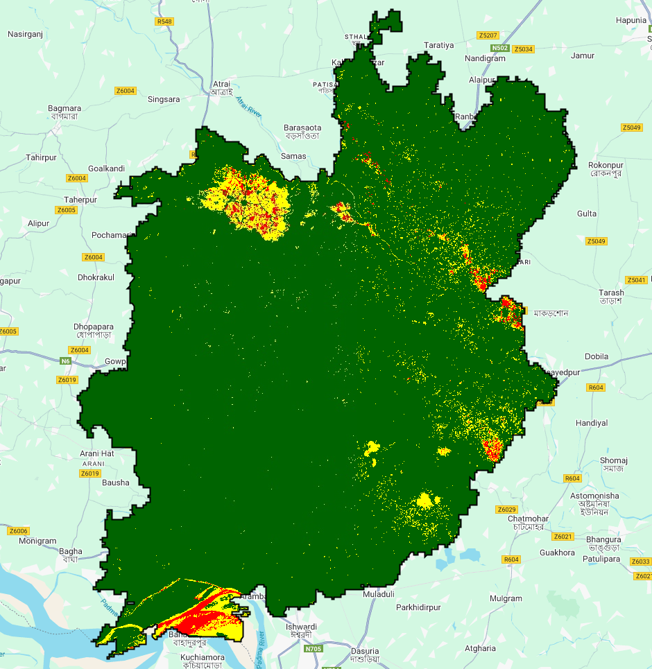

## Flood Risk Mapping of Natore District, Bangladesh using Google Earth Engine

This repository contains Google Earth Engine (GEE) JavaScript code to generate a **Flood Risk Map** for Natore District, Bangladesh.  
The map uses Sentinel-1 SAR data for water detection, elevation data, and Sentinel-2 derived vegetation indices to calculate flood risk zones, visualized with green, yellow, and red colors representing low, medium, and high risk areas respectively.
---
## Features
- Flood risk calculation based on combined criteria:
  - Water presence (Sentinel-1 SAR VV polarization)
  - Low elevation (SRTM DEM)
  - Vegetation cover (NDVI from Sentinel-2)
- Clear, discrete color-coded flood risk zones:
  - **Green** — Low risk
  - **Yellow** — Medium risk
  - **Red** — High risk
- Focused on Natore district boundary
---
## Flood Risk Logic

- **Water detection:** Sentinel-1 SAR VV backscatter thresholding identifies flooded areas.
- **Elevation:** Low-lying areas under 10 meters from SRTM DEM.
- **Vegetation:** NDVI thresholding to identify vegetated land.
- Each factor is weighted and combined into a risk index.
- The index is normalized and split into three risk categories visualized with green, yellow, and red colors.
---

© mdkhademali